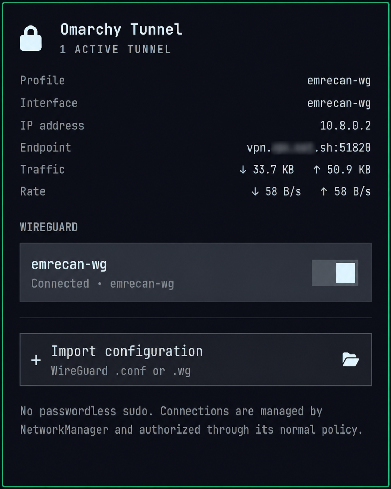
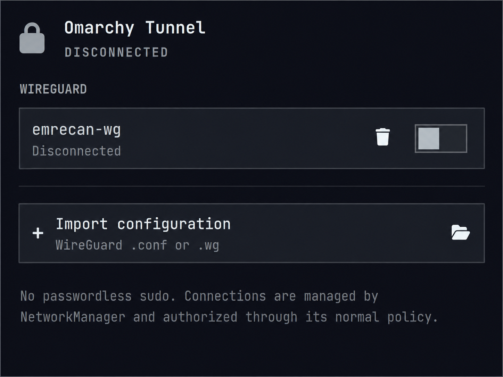
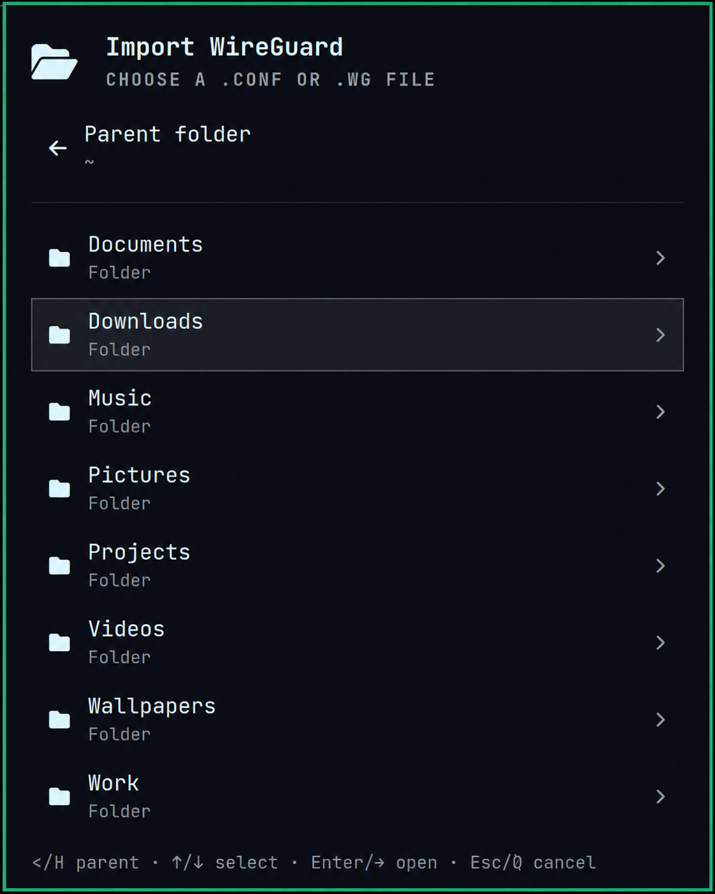

# Omarchy Tunnel

A native Omarchy bar plugin for importing and managing WireGuard connections through NetworkManager.

It works without an elevated helper or an extra background service.

## Screenshots

<p align="center">
  
</p>

<p align="center">
  
  
</p>

## Features

- Import local WireGuard `.conf` and `.wg` files from the built-in browser
- Connect, disconnect, and remove NetworkManager WireGuard profiles
- View the active interface, tunnel IP, endpoint, traffic totals, and transfer rates
- Manage multiple profiles with mouse or keyboard controls
- Keep imported profiles user-scoped with autoconnect disabled

## Requirements

- Omarchy Quattro
- NetworkManager with `nmcli`
- `awk`, `cat`, and `env` from the standard Omarchy base system
- Qt's `Qt.labs.folderlistmodel` module, included with Omarchy's Qt stack

No AUR package or additional service is required.

## Install

```sh
omarchy plugin add https://github.com/ecylmz/omarchy-tunnel.git --enable
```

## Usage

- Left-click the lock icon to open the panel.
- Select a profile or its switch to connect or disconnect.
- Choose **Import configuration** to add a `.conf` or `.wg` file.
- Click the remove button twice to delete an inactive profile.

Use the arrow keys to navigate, `Enter` to select, `I` to import, `R` to refresh, `D` to remove, and `Esc` to close.

## Security

Omarchy plugins run unsandboxed with your user permissions. Review the source before installing.

Omarchy Tunnel delegates connection management and authorization to NetworkManager and Polkit. It does not install sudoers rules, call `wg-quick`, or send telemetry to third-party services. Imported profiles are restricted to the current user and have autoconnect disabled.

WireGuard configurations containing `PreUp`, `PostUp`, `PreDown`, or `PostDown` command hooks are rejected and unsupported.

## Remove

```sh
omarchy plugin remove ecylmz.omarchy-tunnel
```

Removing the plugin does not delete imported NetworkManager profiles. Remove them from the panel first or delete them later with `nmcli`.

## License

[MIT](LICENSE) © 2026 Emre Can Yılmaz
